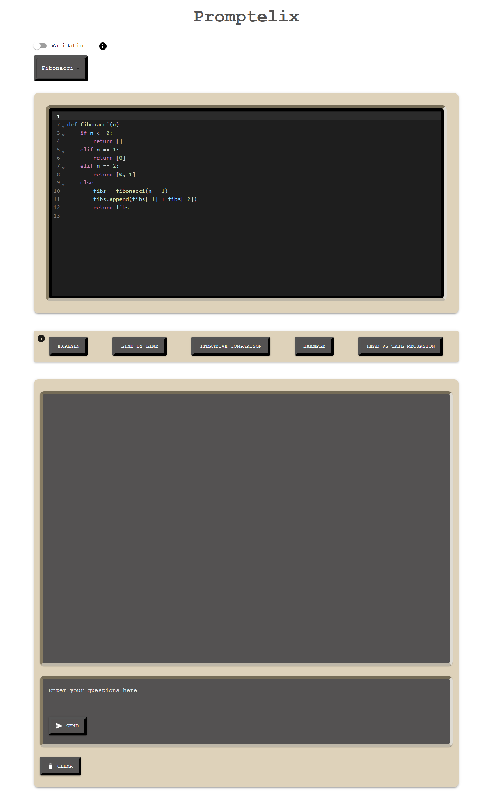

# Recursion Learning Web Application

## Description

This web application is designed to help novice programmers understand and practice **recursion** through promptless interaction with an LLM (GPT). While also allowing the users to create prompts manually, the main focus lies on understanding code, rather than writing effective prompts. It offers features such as an integrated IDE where users can input their code, ask questions about recursion, and receive real-time guidance. The application also includes pre- and post-quizzes to track progress and identify common misconceptions in recursion.

---

## Features

- **API Integration**: The app integrates with the ChatGPT Turbo API for advanced code related questions.
- **Promptless-Interaction**: Several buttons offer sophisticated prompts designed to reduce the cognitive load on students to write good prompts.
- **Validation**: Validation can be enabled, which validates the LLM answers by further LLM operations. This attempts to validate the ambiguous LLM answers through iterative refinement.
- **Interactive IDE**: Users can input their own recursive code and ask questions with or without predefined prompts.
- **Quizzes**: A quiz system is implemented before and after the learning process to assess the user's understanding of recursion.
- **Misconception Detection**: The application identifies common misconceptions related to recursion. <cite>[Sally Hamouda][1]
- **Multiple Question Types**: Supports multiple-choice questions (MCQ) and explain-type questions in quizzes.
- **Real-time Feedback**: Dynamic feedback based on the code and questions entered by the user.

---

## Technologies Used

- **Frontend**: React.js, Material-UI
- **Backend**: Node.js (if applicable)
- **API Integration**: GPT models (can be replaced with similar models with a some minor changes)
- **State Management**: React Hooks (`useState`, `useEffect`)
- **Markdown Rendering**: ReactMarkdown, remark-gfm
- **Testing & Evaluation**: Pre- and post-quizzes with misconceptions tagging

---

## Getting Started

### Prerequisites

Make sure you have the following installed:

- Python 3.9+
- Node.js v17.2.0.+

### Installation

1. Clone the repository:

   - git clone git@gitlab.rz.uni-bamberg.de:cogsys/students/kogsys-15-ects-proj-ss24-trostmann.git
   - cd kogsys-15-ects-proj-ss24-trostmann

2. Create and activate a virtual environment

   - On macOS/Linux
     - python3 -m venv venv
     - source venv/bin/activate
   - On Windows
     - python -m venv venv
     - venv\Scripts\activate

3. Install dependencies:

   - `cd backend`
     - `pip install -r requirements.txt`
   - `cd client`
     - `npm install`

4. Set up API keys for OpenAi API
   - create your own environment file (.env) and include your api key
     - place the created .env file into the ./backend directiory of the project
   - OPENAI_API_KEY = "Your api key"
   - OPENAI_ORG_ID = "Your organization id if you have one"
   - OPENAI_PROJECT_ID = "Project ID"

---

## Usage

### Running the development servers

1. Start the Python server

   - `cd backend`
     - `python server.py`

2. Start the Frontend

   - `cd client`
     - `npm run start`

3. Navigate to http://localhost:3000 in your browser to access the application.

### Production (for the react-app)

- `npm run build`

### Key Features

- **Pre-Quiz and Post-Quiz**: Test your understanding of recursion with quizzes before and after using the application.
  - you need to complete the pre quiz if you want to do the post quiz aswell
- **Input Your Code**: Go to the integrated IDE and input your recursive functions.
- **Ask Questions**: Use predefined buttons or manually ask questions about recursion in the IDE.

---

## License

This project is licensed under the MIT License - see the LICENSE file for details.

---

## Acknowledgments

- Chair of Cognitive Systems at University of Bamberg:
  - Prof. Dr. Ute Schmid
  - M.Sc Sonja Niemann

---

## References

[1]: Sally Hamouda, Stephen H. Edwards, Hicham G. Elmongui, Jeremy V. Ernst &
Clifford A. Shaffer (2017) A basic recursion concept inventory, Computer Science Education, 27:2,
121-148, DOI: 10.1080/08993408.2017.1414728
